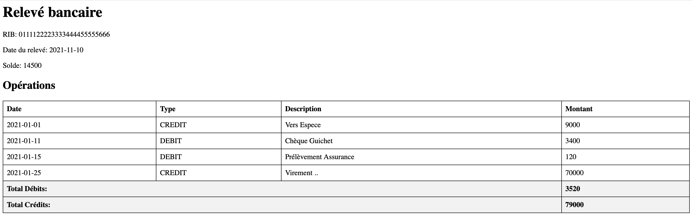
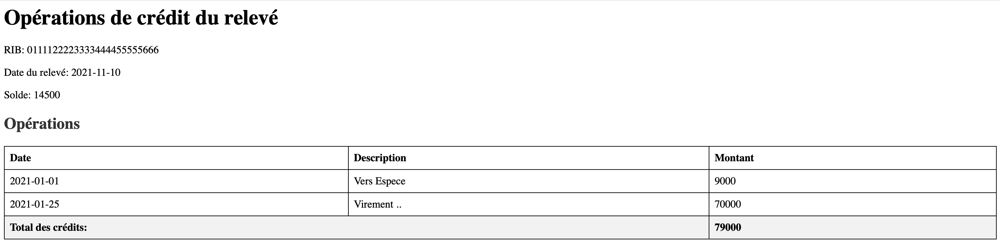

# Relevés de comptes bancaires avec XML (DTD, document XML, schéma XML, feuille de style XSL)

On souhaite créer une application qui permet de gérer des relevés de comptes bancaires. Les données

sont stockées dans des fichiers XML dont le format est le suivant :

## Solutions :


### 1. Elaborer la structure graphique de l’arbre XML

```
releve/
├── @RIB
├── dateReleve
├── solde
└── operations
   ├── @dateDebut
   ├── @dateFin
   └── operation
       ├── @type (CREDIT|DEBIT)
       ├── @date
       ├── @montant
       └── @description
```

### 2. Créer un DTD qui permet de déclarer la structure de ce document XML et créer un exemple de document XML valide par ce DTD
#### DTD

```xml-dtd
<?xml version="1.0" encoding="UTF-8"?>
<!ELEMENT releve (dateReleve, solde, operations)>
<!ATTLIST releve 
                RIB CDATA #REQUIRED>
<!ELEMENT dateReleve (#PCDATA)>
<!ELEMENT solde (#PCDATA)>
<!ELEMENT operations (operation+)>
<!ATTLIST operations 
                    dateDebut CDATA #REQUIRED
                    dateFin CDATA #REQUIRED>
<!ELEMENT operation EMPTY>
<!ATTLIST operation 
                    type (CREDIT|DEBIT) #REQUIRED
                    date CDATA #REQUIRED
                    montant CDATA #REQUIRED
                    description CDATA #REQUIRED>
```

#### Document XML valide

```xml
<?xml version="1.0" encoding="UTF-8"?>
<!DOCTYPE releve SYSTEM "releves.dtd">
<releve RIB="0111122223333444455555666">
    <dateReleve>2021-11-10</dateReleve>
    <solde>14500</solde>
    <operations dateDebut="2021-01-01" dateFin="2021-01-30">
        <operation type="CREDIT" date="2021-01-01" montant="9000" description="Vers Espece"/>
        <operation type="DEBIT" date="2021-01-11" montant="3400" description="Chèque Guichet"/>
        <operation type="DEBIT" date="2021-01-15" montant="120" description="Prélèvement Assurance"/>
        <operation type="CREDIT" date="2021-01-25" montant="70000" description="Virement .."/>
    </operations>
</releve>
```

### 3. Créer un schéma XML qui permet de déclarer la structure de ce document XML et créer un exemple de document XML valide par ce schéma XML
```xaml
<?xml version="1.0" encoding="UTF-8"?>
<xs:schema xmlns:xs="http://www.w3.org/2001/XMLSchema">
   <xs:element name="releve">
      <xs:complexType>
         <xs:sequence>
            <xs:element name="dateReleve" type="xs:date"/>
            <xs:element name="solde" type="xs:decimal"/>
            <xs:element name="operations">
               <xs:complexType>
                  <xs:sequence>
                     <xs:element name="operation" maxOccurs="unbounded">
                        <xs:complexType>
                           <xs:attribute name="type">
                              <xs:simpleType>
                                 <xs:restriction base="xs:string">
                                    <xs:enumeration value="CREDIT"/>
                                    <xs:enumeration value="DEBIT"/>
                                 </xs:restriction>
                              </xs:simpleType>
                           </xs:attribute>
                           <xs:attribute name="date" type="xs:date" use="required"/>
                           <xs:attribute name="montant" type="xs:decimal" use="required"/>
                           <xs:attribute name="description" type="xs:string" use="required"/>
                        </xs:complexType>
                     </xs:element>
                  </xs:sequence>
                  <xs:attribute name="dateDebut" type="xs:date" use="required"/>
                  <xs:attribute name="dateFin" type="xs:date" use="required"/>
               </xs:complexType>
            </xs:element>
         </xs:sequence>
         <xs:attribute name="RIB" type="xs:string" use="required"/>
      </xs:complexType>
   </xs:element>
</xs:schema>
```

### 4. Créer une feuille de style XSL qui permet d’afficher toutes les données de ce document XML au format HTML en affichant le total des opérations de débit et le total des opérations de crédit.

```xaml
<?xml version="1.0" encoding="UTF-8"?>
<xsl:stylesheet version="1.0" xmlns:xsl="http://www.w3.org/1999/XSL/Transform">
    <xsl:template match="/">
        <html>
            <head>
                <title>Relevé bancaire</title>
                <style>
                    table { border-collapse: collapse; width: 100%; }
                    th, td { border: 1px solid black; padding: 8px; text-align: left; }
                    .total { font-weight: bold; background-color: #f2f2f2; }
                </style>
            </head>
            <body>
                <h1>Relevé bancaire</h1>
                <p>RIB: <xsl:value-of select="releve/@RIB"/></p>
                <p>Date du relevé: <xsl:value-of select="releve/dateReleve"/></p>
                <p>Solde: <xsl:value-of select="releve/solde"/></p>
                
                <h2>Opérations</h2>
                <table>
                    <tr>
                        <th>Date</th>
                        <th>Type</th>
                        <th>Description</th>
                        <th>Montant</th>
                    </tr>
                    <xsl:for-each select="releve/operations/operation">
                        <tr>
                            <td><xsl:value-of select="@date"/></td>
                            <td><xsl:value-of select="@type"/></td>
                            <td><xsl:value-of select="@description"/></td>
                            <td><xsl:value-of select="@montant"/></td>
                        </tr>
                    </xsl:for-each>
                    <tr class="total">
                        <td colspan="3">Total Débits:</td>
                        <td>
                            <xsl:value-of select="sum(releve/operations/operation[@type='DEBIT']/@montant)"/>
                        </td>
                    </tr>
                    <tr class="total">
                        <td colspan="3">Total Crédits:</td>
                        <td>
                            <xsl:value-of select="sum(releve/operations/operation[@type='CREDIT']/@montant)"/>
                        </td>
                    </tr>
                </table>
            </body>
        </html>
    </xsl:template>
</xsl:stylesheet>
```

#### Résultat



### 5. Créer une feuille de style XSL qui permet d’afficher au format HTML les opérations de type CREDIT d’un relevé bancaire.
```xml
<?xml version="1.0" encoding="UTF-8"?>
<xsl:stylesheet version="1.0" xmlns:xsl="http://www.w3.org/1999/XSL/Transform">
    <xsl:template match="/">
        <html>
            <head>
                <title>Opérations de crédit</title>
                <style>
                    table { border-collapse: collapse; width: 100%; margin-top: 20px; }
                    th, td { border: 1px solid black; padding: 8px; text-align: left; }
                    .total { font-weight: bold; background-color: #f2f2f2; }
                    h2 { color: #333; margin-top: 20px; }
                </style>
            </head>
            <body>
                <h1>Opérations de crédit du relevé</h1>
                <p>RIB: <xsl:value-of select="releve/@RIB"/></p>
                <p>Date du relevé: <xsl:value-of select="releve/dateReleve"/></p>
                <p>Solde: <xsl:value-of select="releve/solde"/> </p>
                
                <h2>Opérations</h2>
                <table>
                    <tr>
                        <th>Date</th>
                        <th>Description</th>
                        <th>Montant</th>
                    </tr>
                    <xsl:for-each select="releve/operations/operation[@type='CREDIT']">
                        <tr>
                            <td><xsl:value-of select="@date"/></td>
                            <td><xsl:value-of select="@description"/></td>
                            <td><xsl:value-of select="@montant"/> </td>
                        </tr>
                    </xsl:for-each>
                    <tr class="total">
                        <td colspan="2">Total des crédits:</td>
                        <td>
                            <xsl:value-of select="sum(releve/operations/operation[@type='CREDIT']/@montant)"/>
                        </td>
                    </tr>
                </table>
            </body>
        </html>
    </xsl:template>
</xsl:stylesheet>
```

#### Résultat

